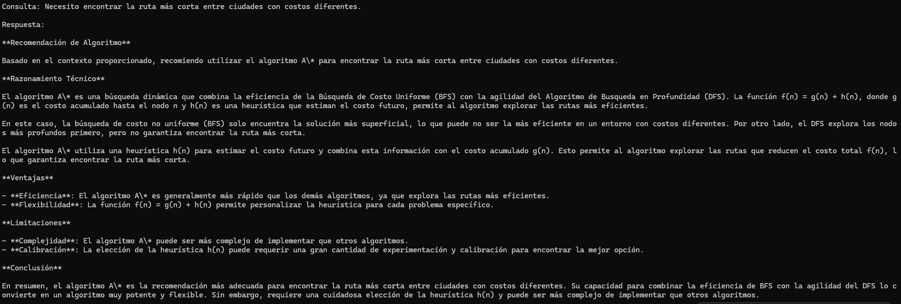

# Analizador Inteligente de Problemas de Búsqueda

MVP académico basado en arquitectura RAG local.

## Tecnologías
- Python
- LangChain
- ChromaDB
- Ollama
- llama3.2
- sentence-transformers

## Funcionalidades
- Indexación de documentos
- Recuperación semántica
- Recomendación de algoritmos de búsqueda
- Respuestas usando modelo local

## Ejecución

```bash
python indexer.py
python retriever.py

## Ejemplo de respuesta



